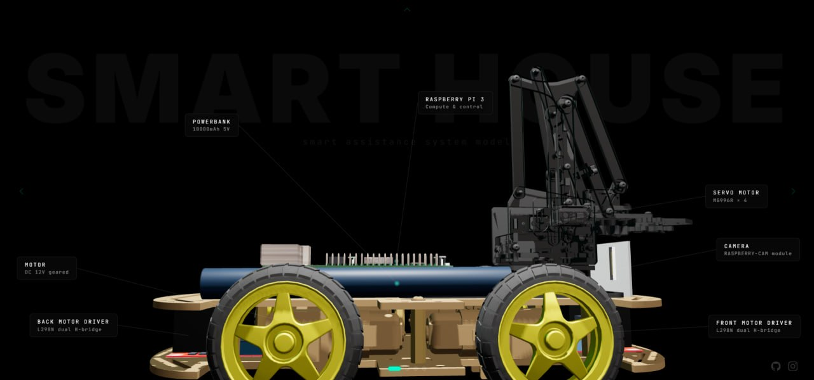

# Autonomous RC Car — Monocular SLAM Navigation

> Indoor autonomous navigation using only a camera and IMU on a Raspberry Pi 3B.

---

## Demo

<table>
<tr>
<td><br/>
<sub>Real-world navigation to Station 1 (3× speed — pauses are due to the low feature count in the room)</sub></td>
<td><br/>
<sub>Web dashboard — same run, showing L-path plan and live position</sub></td>
</tr>
</table>

<br/>
<sub>Terminal trigger → car departs autonomously</sub>

---

## Run the Demo (no hardware required)

```bash
git clone <repo>
cd autonomous-car-nav
pip install fastapi uvicorn pyzmq scipy numpy opencv-python requests
python3 -m navigation.web.server --mode test
```

Open **http://localhost:8080** — pick any station from the grid and click **GO**. The dashboard animates the full L-path, tracks mock position in real time, and updates the navigation phase indicator. No Pi, no SLAM, no camera required.

---

## What It Does

The car navigates between calibrated stations in an indoor room using:

- **Monocular V-SLAM** (ORB-SLAM3) for position — no lidar, no encoders, no depth sensor
- **MPU-6050 IMU** with complementary filter (`ALPHA = 0.98`) for heading during spins
- **L-path planning** for reliable, repeatable perpendicular wall approach
- **ZMQ pub/sub pipeline** connecting Pi hardware to PC navigation compute

SLAM runs on a PC — the Pi 3B at 1 GB RAM cannot run ORB-SLAM3 in real time (it requires ~800 MB at runtime; co-locating it would cause OOM kills or SD card thrash). All sensor data streams over WiFi via ZMQ. Motor commands return over HTTP.

---

## Key Engineering Decisions

These are the problems that took the most time to solve:

- **Slow spin speed** — Pi Cam v2 produces motion blur at normal speeds. ORB features fail on blurred frames and SLAM pose goes null mid-spin. Running at **40% PWM** (`SPIN_SPEED = 40`) keeps SLAM stable through rotation. At 60%+ PWM, ORB-SLAM3 lost tracking and teleported the pose 0.5 m+ in the map.

- **Post-spin SLAM settle** — after spinning, SLAM needs time to reacquire stationary features before poses are trustworthy. Two mandatory holds are enforced unconditionally after every spin: `POST_SPIN_HOLD_SECS = 1.0 s` (motor-stop rollback prevention) and `POST_SPIN_SLAM_WAIT = 0.5 s` (feature reacquisition). Skipping either causes the car to drive on a stale pose.

- **Stall detection** — TT motors stall silently on carpet below ~40% PWM. A sliding-window check on SLAM position (`< 2 mm` progress per step) detects no-movement; after 80 consecutive zero-progress steps (~8 s) a reverse-and-retry is triggered automatically.

- **ArUco relocalization** — when SLAM loses tracking in feature-poor rooms, ArUco markers (DICT_4X4_50, printed and wall-mounted) give absolute pose in under one frame via a custom `InjectPoseHint(Tcw)` C++ API added to ORB-SLAM3. This was necessary because upstream BO W-based relocalization can take several seconds or fail entirely on plain painted walls.

- **IMU drift** — complementary filter blends gyro + accelerometer (`ALPHA = 0.98`) to bound heading drift to acceptable levels for spin durations under 5 seconds (the longest the navigator ever commands). ZUPT (Zero-velocity UPdaTe) via accelerometer variance detection freezes integration when stationary, preventing drift accumulation during SLAM-processing pauses.

---

## Architecture

```
[Pi Cam v2] ──ZMQ:5555──→ [bridge.py] ──POSIX shm──→ [slam_reader C++]
                                                              │
[MPU-6050]  ──ZMQ:5556────────────────────────────→ [navigator.py]  ←── ZMQ:5557
                                                              │
[4× TT motors via L298N] ←────────────────────── HTTP:5000 ──┘
```

| Socket | Direction | Publisher | Subscriber | Content |
|--------|-----------|-----------|------------|---------|
| `tcp://YOUR_PI_IP:5555` | Pi → PC | `camera_zmq.py` | `bridge.py` | JPEG frames |
| `tcp://YOUR_PI_IP:5556` | Pi → PC | `imu_zmq.py` | `navigator.py` | JSON: `heading_deg`, `moving` |
| `tcp://localhost:5557` | PC → PC | `slam_reader` (C++) | `navigator.py` | JSON: `x`, `z`, `seq`, `ok` |
| `http://YOUR_PI_IP:5000/drive` | PC → Pi | `navigator.py` | `car.py` (Flask) | JSON: `{w,a,s,d,total,inner}` |

All ZMQ subscribers use `CONFLATE=1` — only the latest message is kept per socket, preventing queue backlog under SLAM latency spikes.

---

## Hardware



| Component | Details |
|-----------|---------|
| Chassis | RC car, 4× TT motors, 2× L298N H-bridge |
| Compute | Raspberry Pi 3B — 1 GB RAM |
| Vision | Pi Camera v2 (640×480, JPEG @ quality 80, ZMQ:5555) |
| IMU | MPU-6050 (I²C bus 1, addr `0x68`, 50 Hz) |
| Localization assist | ArUco markers (DICT_4X4_50, 18.4 cm), printed and wall-mounted |
| SLAM compute | PC (offloaded from Pi) |

---

## Project Structure

```
navigation/    L-path navigator, web dashboard, calibration tools
slam/          Custom ORB-SLAM3 — ArUco relocalization, pose injection API, serialization fixes
pi/            Motor controller (Flask/GPIO), IMU publisher, camera streamer
data/          calibration.json, MapPoints.txt, MarkerPositions.txt, stations.json
docs/media/    Demo GIFs and renders
```

---

## Documentation

- [Navigation System](navigation/README.md) — L-path algorithm, engineering problems & solutions, web dashboard, calibration tools
- [SLAM Layer](slam/README.md) — custom ORB-SLAM3, ArUco relocalization state machine, ZMQ pose format, build instructions
- [Pi Layer](pi/README.md) — motor GPIO map, IMU complementary filter, camera streaming, network layout
- [ORB-SLAM3 Modifications](slam/CHANGES.md) — C++ changes vs upstream: pose injection, iterator fix, cross-map relocalization
- [Spin Protocol](docs/SPIN_PROTOCOL.md) — SPIN_SPEED tuning methodology and hardware test results
